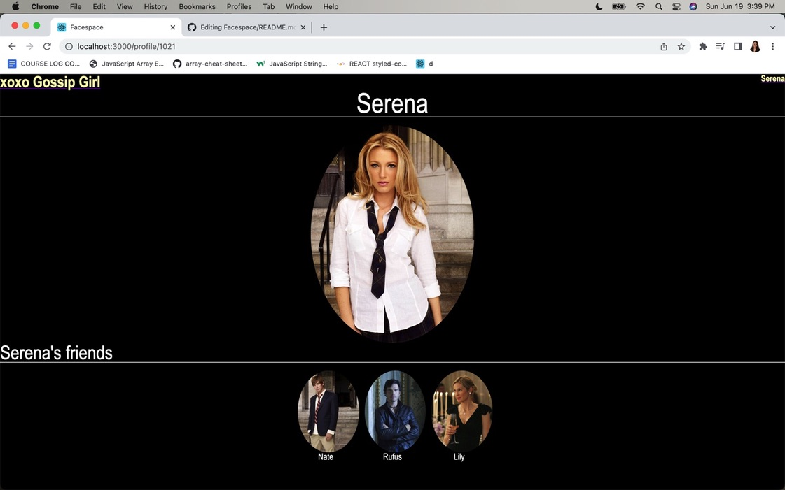
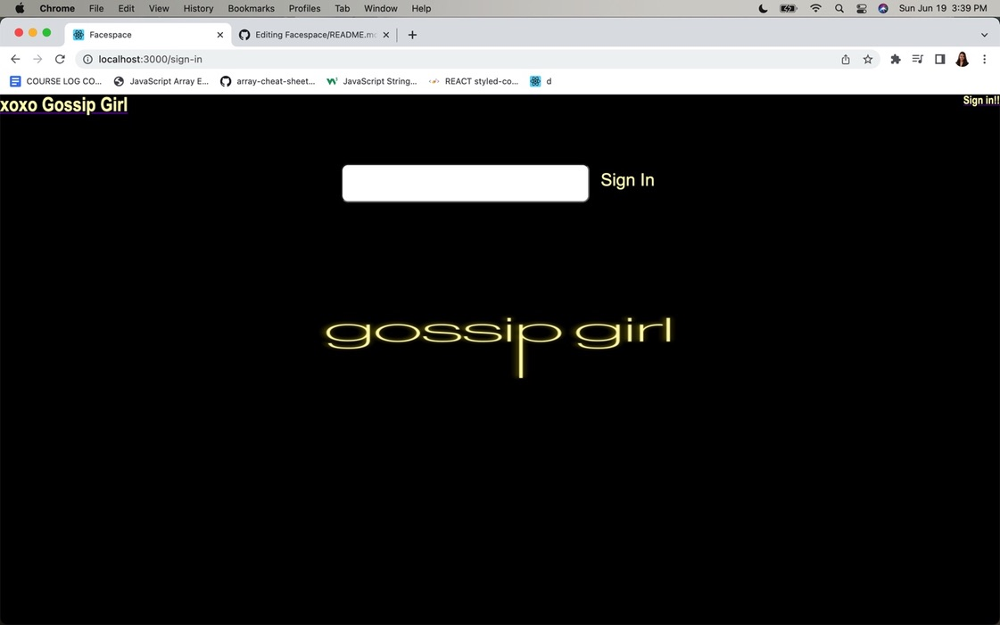
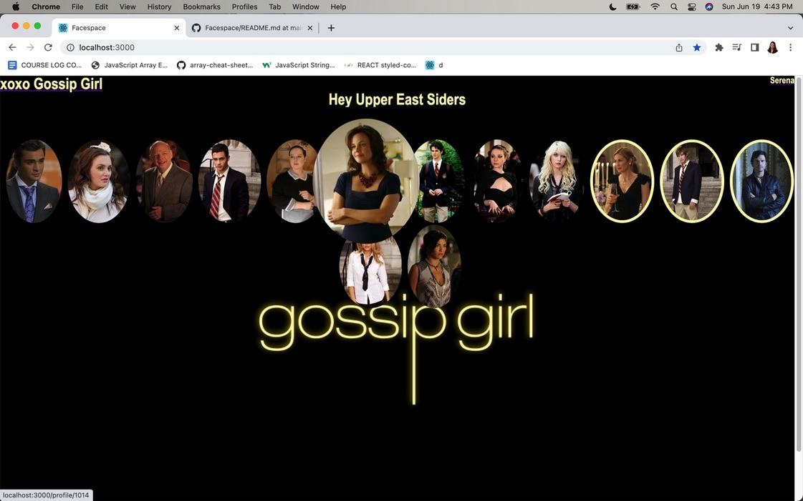
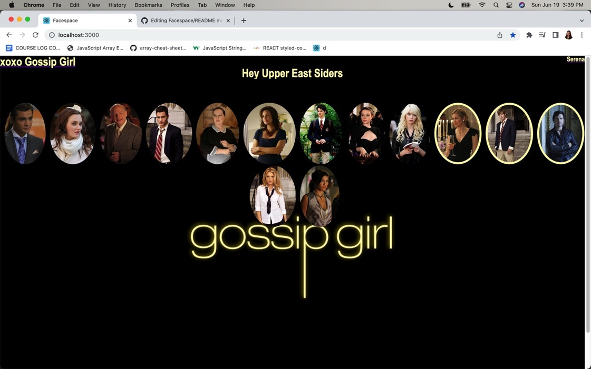

Facespace!

## Goal

Create a site Facebook look alike called Facespace! using React, routing, Node and CSS along the way.

### The Frontend

1. Open a terminal in VS Code
2. Type `cd frontend`
3. Type `yarn install`

Use `yarn dev:frontend` to start the frontend dev environment.

### The Backend

1. Open _another_ terminal in VS Code
2. Type `cd backend`
3. Type `yarn install`

Use `yarn dev:backend` to start the backend dev environment.

## Screenshots

### Homepage

### The Profile Page

### The Sign in page

### Faces on the homepage

effect on hover.

### My Friends!

When a user is signed in and looking at the homepage, there is a visual indication as to who their friends are in the grid of faces.

